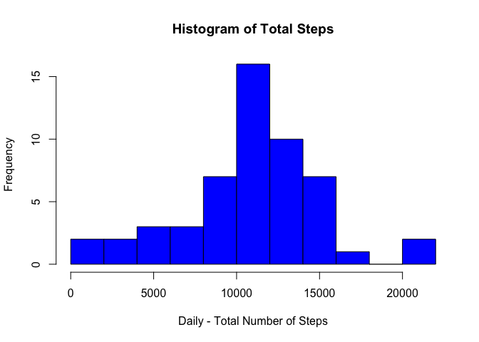
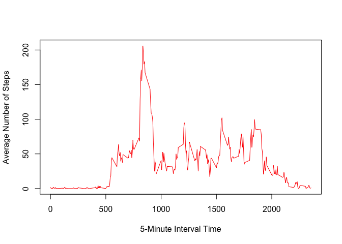
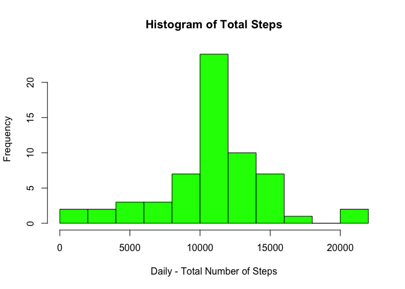

# Reproducible Research: Peer Assessment 1
## Settings
echo = TRUE

## Loading and preprocessing the data

Below are the steps for loading the data for Initial Analysis.
Loaded the file and removed the row with missing values in the original data File

```r
DataFile <- read.csv("activity.csv",sep=",",colClasses = c("numeric","Date","numeric"))
FinalFile <- na.omit(DataFile)
summary(DataFile)
```

```
##      steps             date               interval     
##  Min.   :  0.00   Min.   :2012-10-01   Min.   :   0.0  
##  1st Qu.:  0.00   1st Qu.:2012-10-16   1st Qu.: 588.8  
##  Median :  0.00   Median :2012-10-31   Median :1177.5  
##  Mean   : 37.38   Mean   :2012-10-31   Mean   :1177.5  
##  3rd Qu.: 12.00   3rd Qu.:2012-11-15   3rd Qu.:1766.2  
##  Max.   :806.00   Max.   :2012-11-30   Max.   :2355.0  
##  NA's   :2304
```

```r
summary(FinalFile)
```

```
##      steps             date               interval     
##  Min.   :  0.00   Min.   :2012-10-02   Min.   :   0.0  
##  1st Qu.:  0.00   1st Qu.:2012-10-16   1st Qu.: 588.8  
##  Median :  0.00   Median :2012-10-29   Median :1177.5  
##  Mean   : 37.38   Mean   :2012-10-30   Mean   :1177.5  
##  3rd Qu.: 12.00   3rd Qu.:2012-11-16   3rd Qu.:1766.2  
##  Max.   :806.00   Max.   :2012-11-29   Max.   :2355.0
```

```r
head(FinalFile)
```

```
##     steps       date interval
## 289     0 2012-10-02        0
## 290     0 2012-10-02        5
## 291     0 2012-10-02       10
## 292     0 2012-10-02       15
## 293     0 2012-10-02       20
## 294     0 2012-10-02       25
```

## What is mean total number of steps taken per day?

1. Make a histogram of the total number of steps taken each day

For above the aggregate function is used to sum the total number of steps each day which is displayed in the histogram


```r
WorkFile <- aggregate(FinalFile$steps,list(Date = FinalFile$date),FUN=sum)
names(WorkFile) <- c("Date","Total_Steps")
head(WorkFile)
```

```
##         Date Total_Steps
## 1 2012-10-02         126
## 2 2012-10-03       11352
## 3 2012-10-04       12116
## 4 2012-10-05       13294
## 5 2012-10-06       15420
## 6 2012-10-07       11015
```

```r
hist(WorkFile$Total_Steps,main="Histogram of Total Steps", breaks= 10,xlab="Daily - Total Number of Steps",col="blue")
```

 

2. Calculate and report the mean and median total number of steps taken per day


```r
WorkFileMean <- mean(WorkFile$Total_Steps)
WorkFileMedian <- median(WorkFile$Total_Steps)

WorkFileMean
```

```
## [1] 10766.19
```

```r
WorkFileMedian
```

```
## [1] 10765
```

1. Mean of the the total number of Step per day = 1.0766189\times 10^{4}
2. Median of the the total number of Step per day = 1.0765\times 10^{4}

## What is the average daily activity pattern?

1. Make a time series plot (i.e. type = "l") of the 5-minute interval (x-axis)
and the average number of steps taken, averaged across all days (y-axis)


```r
WorkFile <- aggregate(FinalFile$steps,list(Interval=FinalFile$interval),FUN=mean)
names(WorkFile) <- c("Interval","Average")
plot(WorkFile$Interval,WorkFile$Average,type="l",col="red",xlab="5-Minute Interval Time",ylab="Average Number of Steps")
```

 

2. Which 5-minute interval, on average across all the days in the dataset,
contains the maximum number of steps?


```r
RowValue <- which.max(WorkFile$Average)
MaxInterval <- WorkFile[RowValue,]
MaxValue <- MaxInterval$Interval
MaxValue
```

```
## [1] 835
```

The Time Interval 835 has the maximum steps taken on an average

## Imputing missing values

1. Calculate and report the total number of missing values in the dataset
(i.e. the total number of rows with NAs)

```r
TotalNA <- sum(is.na(DataFile))
TotalNA
```

```
## [1] 2304
```

Total Number of Rows with missing Values in the original Data = 2304


2. Devise a strategy for filling in all of the missing values in the dataset. The
strategy does not need to be sophisticated. For example, you could use
the mean/median for that day, or the mean for that 5-minute interval, etc.

3. Create a new dataset that is equal to the original dataset but with the
missing data filled in.


The missing values of steps are replaced with the average number of steps for that particular time interval for the overall data

The summary and the sample records are shown below for the updated file


```r
for (i in 1:nrow(DataFile)) {
    StepValue <- DataFile[i,"steps"]
    TimeValue <- DataFile[i,"interval"]
      if(is.na(StepValue)) {
              x <- which(WorkFile$Interval == TimeValue)
              DataFile[i,"steps"] <- WorkFile[x,"Average"]
              }

}

head(DataFile)
```

```
##       steps       date interval
## 1 1.7169811 2012-10-01        0
## 2 0.3396226 2012-10-01        5
## 3 0.1320755 2012-10-01       10
## 4 0.1509434 2012-10-01       15
## 5 0.0754717 2012-10-01       20
## 6 2.0943396 2012-10-01       25
```

```r
summary(DataFile)
```

```
##      steps             date               interval     
##  Min.   :  0.00   Min.   :2012-10-01   Min.   :   0.0  
##  1st Qu.:  0.00   1st Qu.:2012-10-16   1st Qu.: 588.8  
##  Median :  0.00   Median :2012-10-31   Median :1177.5  
##  Mean   : 37.38   Mean   :2012-10-31   Mean   :1177.5  
##  3rd Qu.: 27.00   3rd Qu.:2012-11-15   3rd Qu.:1766.2  
##  Max.   :806.00   Max.   :2012-11-30   Max.   :2355.0
```

4. Make a histogram of the total number of steps taken each day and Calculate
and report the mean and median total number of steps taken per day. Do
these values differ from the estimates from the first part of the assignment?
What is the impact of imputing missing data on the estimates of the total
daily number of steps?


```r
WorkFile2 <- aggregate(DataFile$steps,list(Date = DataFile$date),FUN=sum)
names(WorkFile2) <- c("Date","Total_Steps")
head(WorkFile2)
```

```
##         Date Total_Steps
## 1 2012-10-01    10766.19
## 2 2012-10-02      126.00
## 3 2012-10-03    11352.00
## 4 2012-10-04    12116.00
## 5 2012-10-05    13294.00
## 6 2012-10-06    15420.00
```

```r
hist(WorkFile2$Total_Steps,main="Histogram of Total Steps", breaks= 10,xlab="Daily - Total Number of Steps",col="green")
```

 


## Are there differences in activity patterns between weekdays and weekends?

1. Create a new factor variable in the dataset with two levels - "weekday"
and "weekend" indicating whether a given date is a weekday or weekend
day.
2. Make a panel plot containing a time series plot (i.e. type = "l") of the
5-minute interval (x-axis) and the average number of steps taken, averaged
across all weekday days or weekend days (y-axis). The plot should look
something like the following, which was creating using simulated data:


```r
dayCol <- data.frame(weekdays(DataFile$date),stringsAsFactors = FALSE)
names(dayCol) <- c("Day_Of_Week")

for (i in 1:nrow(dayCol)){
  if(dayCol[i,"Day_Of_Week"]=="Saturday") {
      dayCol[i,"Day_Of_Week"] <- "Weekend"
  } else if (dayCol[i,"Day_Of_Week"]=="Sunday"){
      dayCol[i,"Day_Of_Week"] <- "Weekend"  
  } else {
      dayCol[i,"Day_Of_Week"] <- "Weekday"        
            }
              
  }
DataFile <- cbind(DataFile,dayCol)
WorkFile3 <- aggregate(DataFile$steps,list(Interval=DataFile$interval,DayOfWeek=DataFile$Day_Of_Week),FUN=mean)
names(WorkFile3) <- c("Interval","DayOfWeek","Mean")
```
